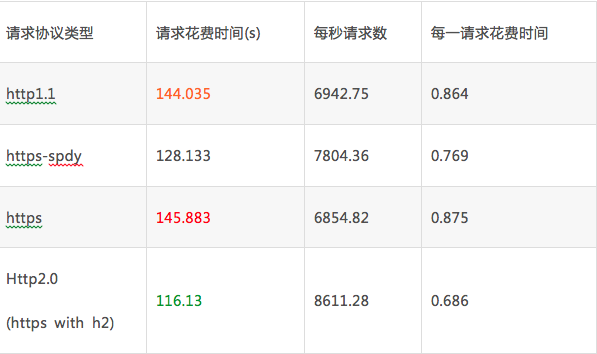
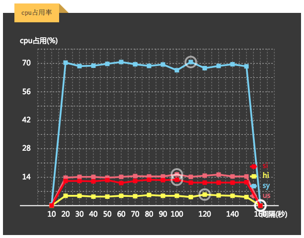
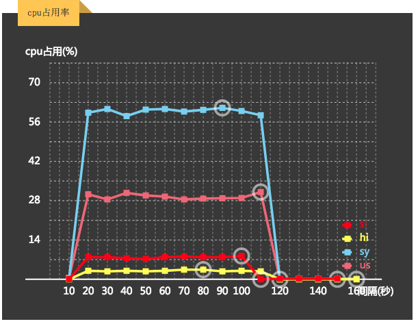

# HTTP2.0之压测 


## 压测数据对比
模拟1,000,000 次请求：

#### 请求花费时间对比


从上表中可以看出http2.0相对http1.1节省近28s的返回时间

#### cpu使用情况

##### http1.1
cpu(us+sy)平均：<span style="color:#ff6600;font-weight:bolder;">82.51%</span>



##### http2.0
cpu(us+sy)平均：<span style="color:#009900;font-weight:bolder;">63.09%</span>



## 如何压测？
测试http1.1是使用了apache的ab命令；

测试http2.0是使用了nghttp2的h2load命令

### 压测http1.x

#### 软件安装
##### 系统
- windows
  1. 下载文件

      访问[apache for windows](https://www.apachehaus.com/cgi-bin/download.plx)
  2. 安装文件

      双击exe文件，一路向下
  3. 配置环境变量

      我的电脑----》右键“属性”---》高级系统设置---》环境变量---》系统变量
      新建系统变量,变量名：APACHE_HOME,变量值：apache安装的目录；并修改Path的值（添加apache的系统变量）；
- Linux
    - Centos/RedHat
      1. ``` yum install apache ```
      2. ab是apache自带的命令，安装后可以直接使用
    - Ubuntu/Debian
      1. ``` apt-get install apache2 ```
- OSX(darwin)
  1. ```brew install apache2 ```
    OSX系统默认已经安装了apache2，ab命令在/usr/sbin/ab

#### 脚本运行

```
  ab -k -t 180 -c 6 -n 1000000 http://172.16.37.66/index.html
```
- -k 使用http的 KeepAlive属性，保持连接处于活动状态
- -t 超时时间
- -c 并发数
- -n 请求数量

### 压测http2.0
#### 软件安装
  - Linux
    - Centos/RedHat
      - 6.8
        1. 下载最新epel-release rpm
        ```
        wget http://dl.fedoraproject.org/pub/epel/6/x86_64/epel-release-6-8.noarch.rpm
        ```
        2. 安装epel-release rpm
        ```
        rpm -Uvh epel-release*rpm
        ```
        3. 安装nghttp2
          ```
            yum install nghttp2
          ```
      - 7.x
        1. 更新yum仓库
          ```
            yum update
          ```
        2. 安装nghttp2
          ```
            yum install nghttp2
          ```

#### 脚本运行
```
  h2load -c 6 -T 180 -n 1000000 https://172.16.37.66/index.html
```
- -c 并发数
- -T 超时时间限制
- -n 请求数量

[HTTP2.0详细介绍](https://blog.csdn.net/xuzhimoaq/article/details/80105247)
